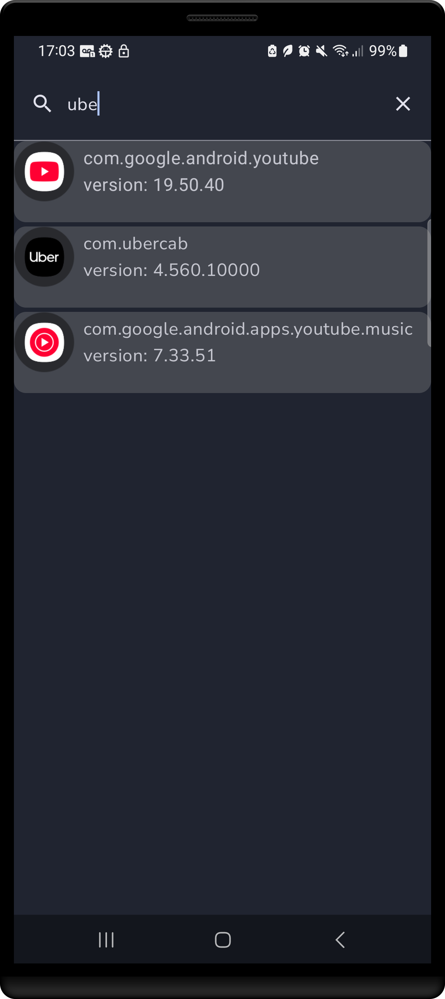

# device-packages

Simple app that displays all package names installed on a device. Used Jetpack Compose UI kit.

User can search for packages so they don't need to scroll infinitely through the list.

> There’s an urban legend among ride-share drivers. A company, let’s say Uber, supposedly knows when a user has competing apps installed, like 99. And when this is supposedly the case, the user ends up getting a discount to choose Uber over 99. Ah, the free market. Who knows...

